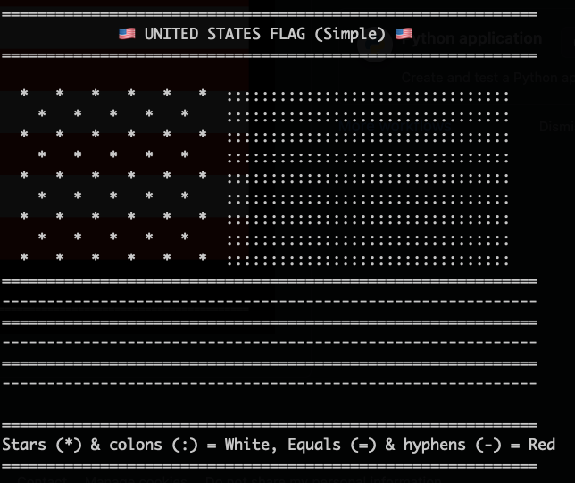

Help me vibe code a US ASCII flag! 

How could it be ... right? 😅

The color version can be improved a bit more. 

The black/white version can be improved *lots* more!

Try to make it as proportional and as accurate as possible: 